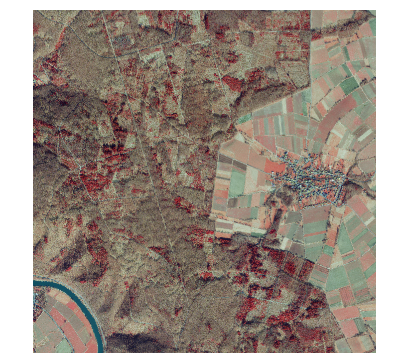
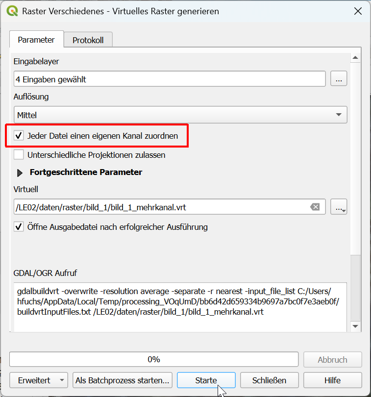
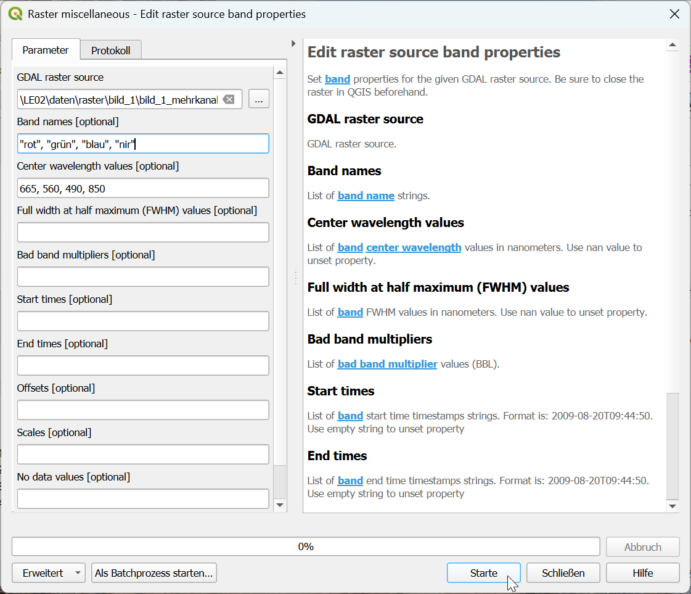
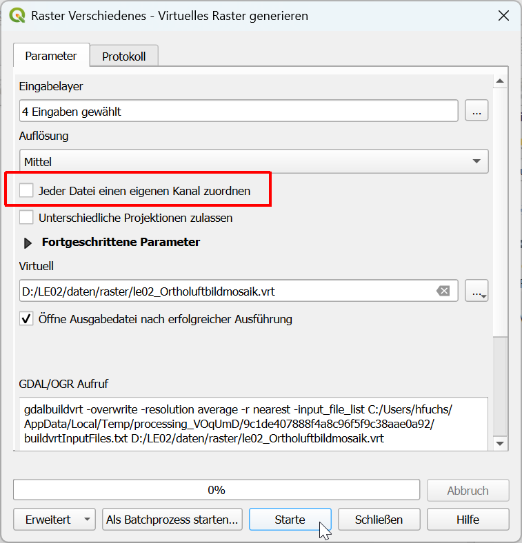
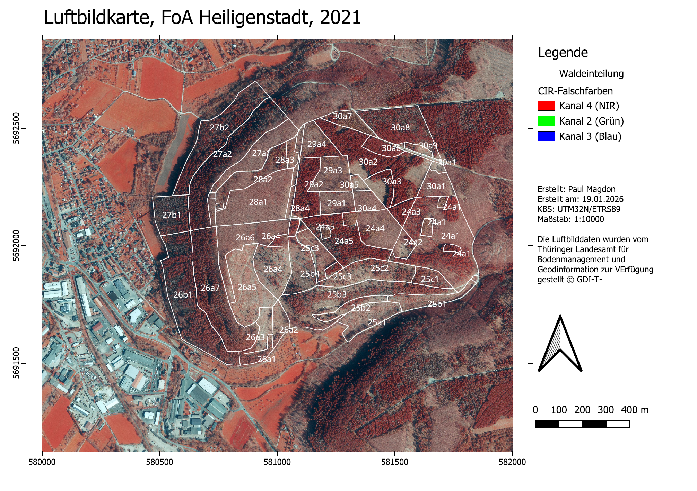

<!--

Skripte für die Übungen 02 des Moduls FPM08 Forstliche Fernerkundung im Studiengang
B.Sc. Forstwirtschaft an der HAWK Göttingen.

Autor: Paul Magdon
Datum: 2025-10-12
Letztes Update: 2026-10-08 (Hans Fuchs)
Lizenz: Creative Commons BY-NC-SA 4.0 https://creativecommons.org/licenses/by-nc-sa/4.0/

-->
# Lerneinheit 02: Erstellen eines Ortholuftbildmosaiks in der Revierförsterei Kattenbühl

{fig-align="center"}

## Lernziele & Aufgabenstellung

Viele Fernerkundungsdaten werden in Form von Rasterdaten gespeichert, welche in einem regelmäßigen
Raster aus Zellen (Pixel) organisiert sind. In jedem Pixel wird genau ein Zahlenwert gespeichert.
Typische Dateiformate für Rastergeodaten sind GeoTIFF (\*.tif), ArcInfo ASCI (\*.ascii), Geopackage
(\*.gpkg) und ERDAS Imagine (\*.img).

In der Übung soll der Umgang mit Rasterdaten vorgestellt und geübt werden. Dazu wird für die Niedersächsische
Revierförsterei Kattenbühl ein Ortholuftbildmosaik erstellt, mit unterschiedlichen Optionen visualisiert und eine Luftbildkarte ausgegeben. Es wird vorgestellt wie Rasterdaten in QGIS importiert, Eigenschaften von Rasterdaten untersucht und Rasterdaten visualisiert werden können. Außerdem werden aus einzelnen Kanälen Mehrkanalbilder erstellt 
und diese dann in einem virtuellen Bildmosaik zusammengeführt.

**Lernziele**

Die Studierenden sollen:

-   verschiedene Rasterdatenformate kennenlernen
-   Rasterdaten in QGIS importieren
-   Eigenschaften von Rasterdaten in QGIS untersuchen und manipulieren können
-   Mehrkanalbilder und Bildmosaike mithilfe von virtuellen Rastern erstellen können
-   unterschiedliche Visualisierungsmethoden für Ein- und Mehrkanalrasterbilder nutzen können

**Aufgaben**

1.  Importieren sie einzelne Kanäle eines Ortholuftbildes und untersuchen sie die
    Rastereigenschaften

2.  Fügen sie einzelne Kanäle zu einem virtuellen Mehrkanalbild zusammen

3.  Erstellen sie ein virtuelles Orthobildmosaik

4.  Erstellen sie eine Echt- und eine Falschfarben-Darstellung

## Anlegen eine neuen QGIS-Projektes

Folgen sie der Anleitung aus @sec-projekt_management um eine neue Ordnerstruktur und ein neues
QGIS-Projekt für LE02 anzulegen.

## Import der Ortholuftbilder

Die Ortholuftbilder werden als GeoTiff-Dateien getrennt in den einzelnen Bändern (b1, b2, b3, b4) zur
Verfügung gestellt. Für die Übung arbeiten wir mit vier Luftbildkacheln á vier Bänder, so dass 16 Raster Layer
importiert werden. Um den Import übersichtlich zu gestalten, empfiehlt es sich für jede Kachel
zunächst im Layer-Panel und im raster Ordner des Projektes einen Ordner/ Gruppe für jede Kachel
(bild_1, bild_2, ...) anzulegen. Kopieren Sie sich die Daten der Übung dazu vom Netzlaufwerk in
ihren Projektordner. Die einzelnen Rasterdateien können dann entweder per drag & drop aus dem
Windows-Explorer oder über das Import-Menü zu den Layer-Gruppen hinzugefügt werden.

::: {style="border: 2px solid #afca0b; background-color: #fafafa; padding: 8px;"}
`Layer` → `Datenquellenverwaltung` → `Raster` → `File`
:::

Importieren sie für jede Luftbildkachel vier Bänder (b1, b2, b3, b4). Nutzen sie anschließend die
Layereigenschaften, um folgende Fragen zu beantworten:

::: {style="border: 3px solid #ff8a0b; background-color: #ffffff; padding: 8px;"}
**Fragen:**

1.  *Wieviele Pixel hat ein Band?*

2.  *Welche räumliche Auflösung haben die Rasterbilder?*

3.  *Welches Koordinatenreferenzsystem haben die Rasterbilder?*

4.  *Was ist der kleinste und der größte Zahlenwert der Rasterbilder?*
:::

## Erstellen von Mehrkanalbildern {#sec-mehrkanalbilder}

Nach dem Import der einzelnen Kanäle werden diese in QGIS als Graustufenbilder dargestellt. Damit
QGIS diese als Farbbilder darstellen kann, müssen alle Bänder eines Raster zusammengeführt werden.
Dafür gibt es unterschiedliche Optionen. Eine Variante ist das Speichern aller Bänder in eine neue
Vierkanal-Rasterdatei. In diesem Fall würden wir aber eine Kopie der Daten anlegen und
brauchten den doppelten Speicherplatz. Eine effizientere Methode, um das Kopieren der Daten zu
vermeiden, sind virtuelle Raster im GDAL-VRT Format (siehe: <https://gdal.org/en/stable/drivers/raster/vrt.html>). Ein virtuelles Raster ist eine Textdatei im XML-Format, in dem nur die Pfade und Einstellungen der einzelnen Raster hinterlegt sind.
QGIS kann diese Textdateien lesen und die einzelnen Raster dann wie ein Mehrkanalbild verarbeiten.

Erstellen sie für jedes der vier Bänder eine VRT-Datei in dem jeweiligen Bildordner.

::: {style="border: 2px solid #afca0b; background-color: #fafafa; padding: 8px;"}
`Raster` →`Sonstiges` → `Virtuelles Raster generieren`
:::
 

Im ersten Schritt werden unter Input layers die vier Bänder ausgewählt. wichtig ist hier das die
Reihenfolge der Bänder aufsteigend angezeigt wird (b1, b2, b3, b4). Sollte das nicht der Fall sein kann
die Reihenfolge per drag & drop in dem Menü entsprechend angepasst werden. Da mehrerere Bänder
zusammengeführt werden ist es wichtig, dass die Option *"Jeder Datei einen eigenen Kanal zuordnen"* aktiviert wird. Unter Virtuell wird die Ausgabedatei angegeben. Diese sollte z.B. *LE02/raster/bild_1/bild_1_mehrkanal.vrt* heißen.

## Editieren der Raster Metadaten
Wenn Rasterdaten weitergegeben, visualisiert oder in der EnMAP-Box weiterverarbeitet werden, ist es wichtig korrekte Bandnamen und zentrale Wellenlängen (in der Einheit Nanometer) in den Metadaten zu speichern. In der Werkzeugkiste finden Sie dafür

`Verarbeitung → Werkzeugkiste → EnMAP-Box → Raster → Raster miscellaneous → Edit raster source band properties.`

Da das Modul direkte Änderungen in die Datei einfügt, also keine neue Datei anlegt, sollten Sie die Rasterdatei vorher in QGIS schliessen. Markieren Sie den Rasterlayer-Namen, Rechtsklick → Layer löschen.

- **GDAL raster source:** Wählen Sie die vrt Datei `bild_1_mehrkanal.vrt` aus.
- **Band names**:"rot", "grün", "blau", "nir"
- **Center wavelenght**: 665, 560, 490, 850

Auf `Starte` klicken.

## Echt- und Falschfarben-Darstellungen von Luftbildern {#sec-CIR_darstellung}

Nach dem ein Mehrkanalraster als virtuelle Datei angelegt wurde, stellt QGIS diese sofort als
Farbbild dar. Dabei nutzt QGIS die Standardeinstellungen für Raster und interpretiert die Bänder wie
folgt:

Band 1: rot; Band 2: grün; Band 3: blau.

**Echtfarben Darstellung**

Wenn die spektralen Bereiche der Bänder den primären Farbkanälen zugeordnet werden, also Kanal (Band) 1: rot zum Roten Kanal, Kanal (Band) 2: grün zum grünen Kanal und Kanal (Band) 3: blau zum blauen Kanal wird das Raster in den echten Farben dargestellt. In vorliegenden Fall ist das bereits korrekt und führt automatisch zu einer Echtfarbendarstellung. Dies muss jedoch nicht
immer der Fall sein. Daher ist es wichtig, die Zuordnung der Bänder zu den Farben in den
Layereigenschaften zu überprüfen. Dazu mit Rechtsklick auf den jeweiligen VRT-Layer:

::: {style="border: 2px solid #afca0b; background-color: #fafafa; padding: 8px;"}
`Eigenschaften` → `Symbolisierung` → `Darstellungsart` → `Multikanalfarbe`
:::

Hier wird angezeigt, welches Band für welchen Farbkanal verwendet wird.

**Color-Infrarot (CIR) Darstellung**

Zur Beobachtung von Wäldern und Pflanzen werden häufig falschfarben Darstellungen gewählt. Sie
zeigen nicht die Farben wie sie in der Realität vorgefunden werden, sonden machen besonders
Unterschiede in der Vegetation sichtbar. Dazu wird häufig der rote Kanal mit den Reflexionsdaten aus
dem Nahen Infrarot Spektrum ersetzt.

QGIS bietet die Möglichkeit für jeden Layer mehrere Symbolisierungen zu hinterlegen. Dadurch ist es
dann möglich sehr einfach zwischen unterschiedlichen Ansichten zu wechseln. Um ein weitere
Symbolisierung für einen Layer anzulegen klicken wir mit der rechten Maustaste auf einen Layer und
wählen:

::: {style="border: 2px solid #afca0b; background-color: #fafafa; padding: 8px;"}
`Stil` → `Stil hinzufügen` → `Name: CIR`
:::

Anschließend öffnen wie wieder die Symbolisierung des Layers und wählen in der Darstellungsart Multikanalfarbe
für den Roten Farbkanal Band 4: nir, für den Grünen Farbkanal Band 1: rot und den Blauen Farbkanal Band 2: grün. Dadurch wird nun eine CIR-Falschfarben Darstellung angezeigt.

::: {style="border: 3px solid #ff8a0b; background-color: #ffffff; padding: 8px;"}
**Frage:**

1.  *Wie unterscheiden sich die Echtfarben- und die CIR-Darstellung?*

2.  *Welche Objekte können Sie in der CIR-Darstellung besser erkennen, welche schlechter?*
:::

## Erstellen eine Ortholuftbildmosaiks {#sec-mosaikieren}

Die Ortholuftbilder werden, wie die meisten Rasterdaten, in sogenannten Kacheln (engl. tiles) z.B.
mit einer Größe von 2000 m x 2000 m ausgeliefert. In der Übung haben vier solche Kacheln vorliegen.
Zur Abdeckung größere Gebiete werden meistens mehrere Kacheln benötigt. Besonders für große Gebiete
kann das sehr aufwendig werden, da die Einstellungen z.B. der Darstellung für jede Kachel einzeln
angepasst werden muss. Daher ist es sinnvoll die Kacheln eines zusammenhängenden Gebietes
zusammenzuführen. Diese Zusammenstellung mehrere Bilder die räumlich benachbart sind, bezeichnet man
in der Fernerkundung häufig als Bildmosaik. QGIS bietet unterschiedliche Möglichkeiten Bildmosaike
zu erstellen. Ein Option wäre es mehrere Kacheln zusammenzuführen und als neue GeoTiff-Datei
abzuspeichern. Diese hätte den Vorteil, dass wir für das jeweilige Gebiet nur noch eine Datei
hätten. Es gibt bei diesem Vorgehen allerdings mehrere Nachteile. Je nach Gebietsgröße werden die
Dateien sehr groß. Das kann dann zu sehr langen Ladezeiten führen, wenn man in das Bild zoomt.
Außerdem würde auch wieder eine Kopie der Daten angelegt, was zu einem größeren Speicherplatzbedarf
führt. Alternativ kann auch für dieses Problem ein virtuelles Raster verwendet werden. Anders als im
oberen Abschnitt nutzen wir diese Funktion nun um benachbarten Bilder zusammenzuführen.
Voraussetzung dafür ist, dass die Bilder das selbe Koordinatenreferenzsystem nutzen, die räumliche
Auflösung und die Anzahl der Bänder identisch ist.

Zum Erstellen eines VRT-Mosaiks nutzen wir wieder:

::: {style="border: 2px solid #afca0b; background-color: #fafafa; padding: 8px;"}
`Verarbeitung` →`Werkzeugkiste` → `Virtuelles Raster generieren` → `Raster` → `File`
:::

Diesmal wählen wir als Input die vier virtuellen Mehrkanalbilder (VRTs) die wir bereits erzeugt haben. Als
Ausgabe definieren wir das VRT le02_Ortholuftbildmosaik.vrt, welches wir im Rasterordner ablegen.

{fig-alt="Ortholuftbildmosaik als VRT anlegen"}

::: callout-caution
Da wir die einzelnen Bilder nebeneinander anordnen wollen wählen wir hier **nicht** die Option *"Jeder Datei einen eigenen Kanal zuordnen"*
:::

Als Ergebnis haben wir nun eine VRT-Datei, mit der wir gleichzeitig alle Bänder und alle Kacheln
darstellen können. Dies ermöglicht es nun auch die Darstellung aller Bilder
gleichzeitig und einheitlich anzupassen. Legen sie dazu wie oben beschrieben für das Orthomosaik
einen neuen Stil *'CIR'* an und stellen sie das Mosaik als CIR-Abbildung dar.

## Erstellen eines Kartenlayouts zur Ausgabe einer Luftbildkarte

Wir können das Orthobildmosaik als Luftbildkarte im Format PDF ausgeben, ein wichtiges Produkt für die Übersicht in einem Forstrevier und zur Erstellung detaillierter Arbeitskarten.

In einem QGIS Projekt können mehrere Karten erstellt und gespeichert werden. Zur Verwaltung der
verschiedenen Karten wird der Kartenlayout-Manager verwendet. Sie finden dieses im Menü unter Projekt.
Hier können sie ein neues Drucklayout „Luftbild“ anlegen.

Nachdem sie ein Kartenlayout im Manager angelegt haben öffnet sich ein neues Fenster mit dem noch
leeren Kartenlayout. Um ein erstes Layout zu erstellen gehen wir schrttweise vor:

1.)  Hinzufügen eines Kartenfelds.

Dazu wählen sie links das Werkzeug "Karte hinzufügen" und ziehen anschließend in ihrem Layout ein
Kartenfeld auf. QGIS stellt danach automatisch die Layer aus dem Hauptfenster dar.

2.) Hinzufügen eines Titels

Dazu wählen sie links das Werkzeug "Beschriftung hinzufügen" und ziehen anschließend ein Textfeld
oberhalb ihrer Karte auf. Geben sie dann im Feld rechts unter „Beschriftung“ einen sinnvollen Titel
(z.b. Luftbildkarte FoA Heiligenstadt) ein und wählen sie eine passende Schriftgröße aus.

3.) Hinzufügen einer Legende

Dazu wählen sie links das Werkzeug "Legende hinzufügen" aus und ziehen anschließend ein Legendenfeld
rechts neben ihren Kartenfeld auf. QGIS übernimmt für die Legende dann automatisch die
Symbolisierung aller Layer des Projektes. Wenn sie rechts unter Legendenelemente die Funktion
„Automatisch aktualisieren“ entfernen, können sie Einträge manuell hinzufügen und entfernen.

4.) Hinzufügen eine Nordpfeils

Dazu wählen sie links das Werkzeug "Nordpfeil hinzufügen" und ziehen anschließend ein Fenster für
den Nordpfeil auf.

5.) Koordinatengitter hinzufügen

Um ein Koordinatengitter hinzuzufügen selektieren sie zunächst das Kartenfenster in dem sie darauf
klicken. Anschließend öffnen sie die Option „Gitter“, die ihnen im rechten Teil unter den
Haupteigenschaften des Kartenfelds angezeigt wird. Über das grüne Plus Symbol legen sie ein neues
Gitter an. Anschließend wählen sie dieses Gitter aus, und klicken auf „Gitter ändern“. Hier ändern
wir folgende Optionen:

-   Gittertype: „Nur Rahmen und Beschriftungen“

-   Intervall: X=500m, Y=500m

-   Rahmenstil: „Äußere Markierung“

-   Koordinaten zeichnen: „ja“

-   Koordinaten nur "links" und "unten". "Oben und "rechts" deaktivieren

-   Koordinatengenauigkeit: 0

6.) Maßstab

Fügen sie ein graphischen Maßstabsbalken hinzu. Dazu wählen sie links das Werkzeug "Maßstab
hinzufügen" und ziehen anschließend ein Fenster für den Maßstab auf. Über die Eigenschaften dieses
Elements können sie z.B. die Anzahl an Segmenten steuern.

7.) Kartenfeld

Sie sollten der Karte noch einige weitere Metadaten hinzufügen. Dazu legen sie, wie beim Titel, ein
neues Textfeld an und ergänzen hier ihren Namen und das Koordinatenreferenzsystem.

