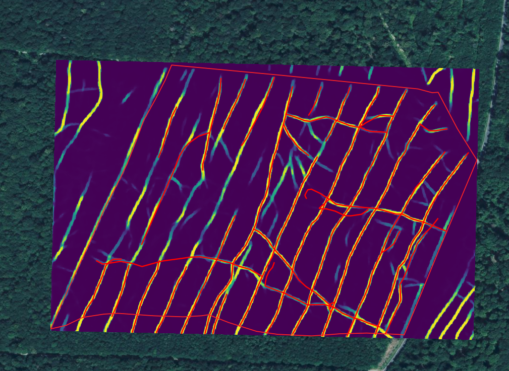
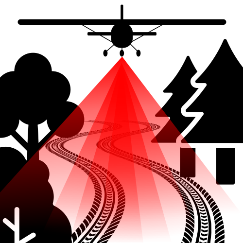
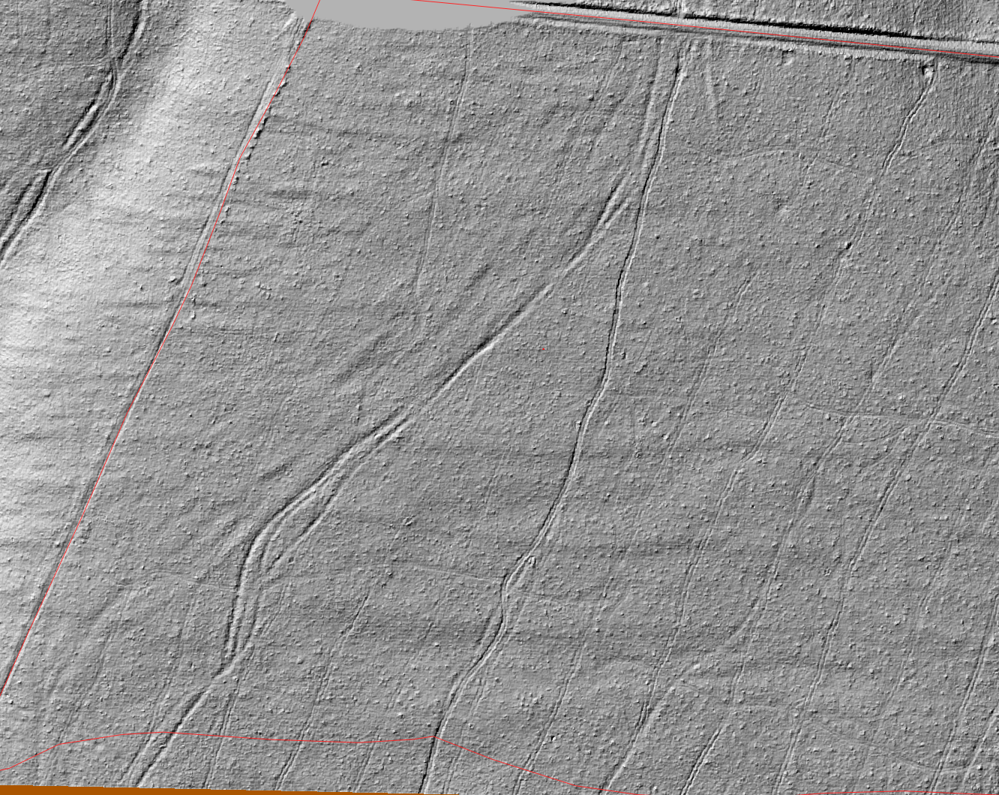
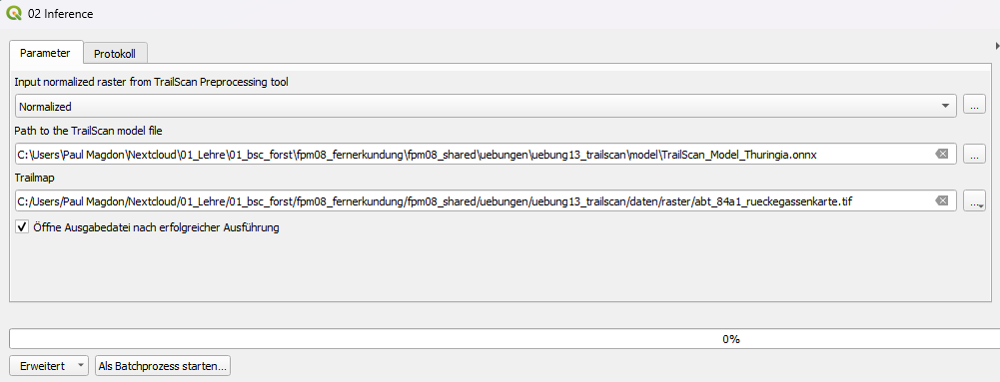
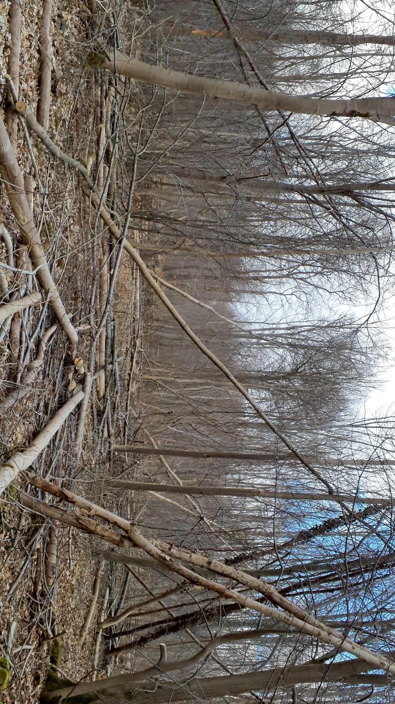
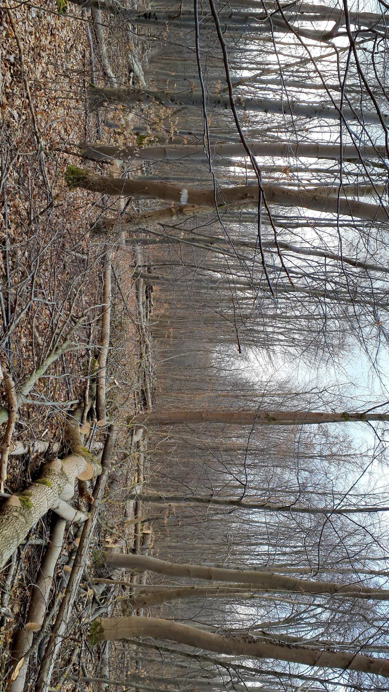
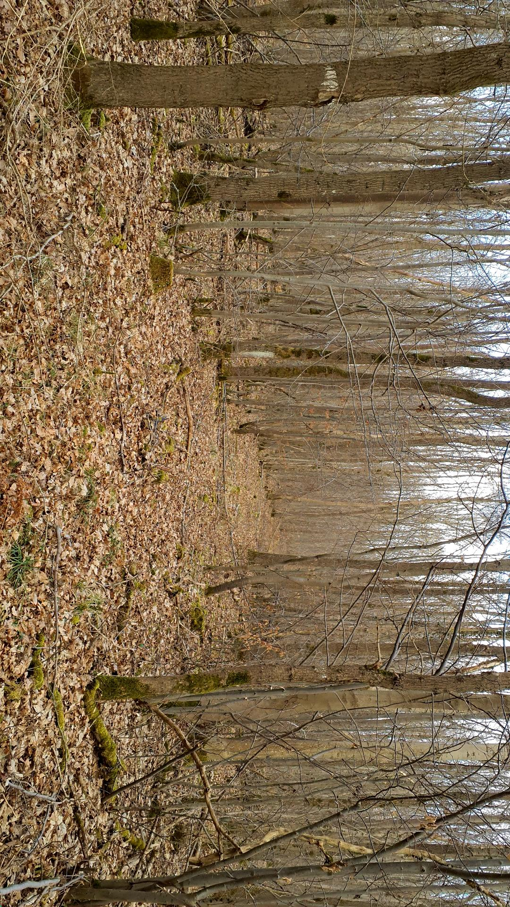

```{=html}
<!--

Skripte für die Übungen 13 des Moduls FPM08 Forstliche Fernerkundung im Studiengang
B.Sc. Forstwirtschaft an der HAWK Göttingen.

Autor: Paul Magdon
Datum: 2026-01-09
Lizenz: Creative Commons BY-NC-SA 4.0 https://creativecommons.org/licenses/by-nc-sa/4.0/

-->
```

# Lerneinheit 13: Kartierung von Rückegassen mit ALS-Daten

{#le13_cover}

In dieser Lehreinheit wird vorgestellt, wie ALS-Daten für die digitale Kartierung von forstlichen
Rückegassen genutzt werden können. Als Fallbeispiel dient ein Bestand nahe der Ortschaft Menteroda
in Thüringen. Hier soll im ersten Schritt eine Kartierung durch visuelle Interpretation der
aufbereiteten Geländemodelle erfolgen. Anschließend wird das, von der HAWK entwickelte,
[TrailScan-Plugin](https://github.com/GISLAB-HAWK/TrailScan-QGIS-Plugin) genutzt, um mithilfe eine
CNN-Modells die vorhandenen Rückegassen automatisch zu kartieren.

## Lernziele & Aufgabenstellung

**Lernziele**

Die Studierenden sollen:

-   Aus ALS-Daten Gelände- und Mikroreliefmodell ableiten um diese für die visuelle Kartierung von
    Rückegassen in Waldbeständen zu nutzen

-   Mithilfe eines bereits trainierten KI-Modells die Rückegassen automatisch kartieren.

-   Die Ergebnisse beider Ansätze sollen verglichen und diskutiert werden.

**Aufgaben**

1.  Raster- und Vektordaten importieren

2.  Berechnung des Gelände- und Mikroreliefmodells

3.  Visuelle Kartierung der Rückegassen

4.  Automatisierte Kartierung der Rückegassen

## Aufgabe 0: Anlegen eine neuen QGIS-Projektes und Kontrolle des Nutzerprofils

Folgen sie der Anleitung aus LE01 @sec-projekt_management um eine neue Ordnerstruktur und ein neues
QGIS-Projekt anzulegen. In der Übung bietet es sich an den Ordner *"daten"* weiter in die
Unterordner *"vektor"* und *"raster"* zu unterteilen. Zusätzlich ist es für diese Übung sinnvoll
einen Ordner "modelle" anzulegen. Prüfen sie außerdem ob Ihr Nutzerprofil korrekt geladen wurde und
ob die OTB-Funktionen im Werkzeugkasten vorhanden sind. Sollte dies nicht der Fall sein stellen sie
ihr gesichertes Nutzerprofil wieder her (siehe auch LE01 @sec-nutzerprofil).

## Aufgabe 01: Download und Import der Geodaten

### **ALS-basierte Höhendaten**

Für die Übung verwenden wir Höhendaten des Thüringer Landesamts für Bodenmanagement und
Geoinformation (TLBG). Diese Höhendaten wurden mit Hilfe eines Airborne Laser Scanners (ALS) im
Februar 2023 erfasst. Das TLBG stellt sowohl die Punktinformation (LAZ), als auch bereits gerasterte
digitale Geländemodelle (DGM) und digitale Oberflächenmodelle (DOM) mit einer räumlichen Auflösung
von 1m zur Verfügung. Für die Übung verwenden wir Punktwolkendaten. Um die Rechen- und
Downloadzeiten zu verkürzen, wurden diese Daten bereits heruntergeladen und auf den Bestand
zugeschnitten. Der vorbereitete ALS-Datensatz kann als copc.laz Datei unter folgendem Link
heruntergeladen werden:

<https://cloud.hawk.de/index.php/s/xr5ZK5jNEG86qDC>

### Vektordaten

Für die Übung arbeiten wir mit einem Bestanden 84a1. Sie finden ein Geopackage mit den Außengrenzen
des Bestandes unter folgendem Link:

<https://cloud.hawk.de/index.php/s/jFDLF2NqjA9LWB3>

Im Rahmen des [TrailScan-Projektes](https://www.hawk.de/de/forschung/forschungsprojekte/trailscan)
der HAWK wurden in einer Teilfläche des Bestandes die vorhandenen Rückegassen mit einem
differenziellen GNSS-Empfänger eingemessen. Diese Daten sollten zur Validierung genutzt werden und
können unter folgendem Link heruntergeladen werden:

<https://cloud.hawk.de/index.php/s/zSwM5wPabEFEkX2>

## Aufgabe 02: Berechnung der ALS-Rasterkarten für die Kartierung der Rückegassen

Für die visuelle und automatisierte Kartierung der Rückegassen werden aus den ALS-Punktwolken vier
Rasterkarten mit einer räumlichen Auflösung von 25cm abgeleitet: Geländemodell (DGM),
Vegetationshöhenmodell (VHM), Mikroreliefmodell (MRM) und Vegetationsdichte (VI). Die Berechnung
dieser Rasterkarten kann mit dem TrailScan-Plugin automatisiert durchgeführt werden.

### Installation des TrailScan-Plugins

{width="301"}

Zur Installation des TrailScan-Plugins öffnen sie `Menü->Erweiterungen->Erweiterungen verwalten` und
suchen sie dort nach der Erweiterung “TrailScan“. Nach der erfolgreichen Installation sollten sie
das TrailScan Tool unter in den Verarbeitungswerkzeugen angezeigt bekommen.

::: callout-important
## Installation einer alternativen Plugin-Version 

Sollten Probleme bei der Installation des Plugins über den Plugin Manager auftreten, kann alternative eine aktualisierte BETA Version des Plugins als ZIP Datei hier heruntergeladen werden: <https://cloud.hawk.de/index.php/s/C5qz8kJErQkZ335> 

Die Zip Datei kann im Plugin manager - Aus ZIP installieren - direkt geladen werden. Nach der Installation ist eventuell ein Neustart von QGIS nötig.  
:::

### Berechnung der ALS-Rasterkarten /Pre-Processing

Das TrailScan-Plugin bietet zwei Funktionen "Pre-Processing Point Cloud" und "Inference". Mit der
ersten Funktion können die genannten Rasterkarten erzeugt werden die sie unter
`Verarbeitung->Werkzeugkiste-TrailSCan>01 Preprocessing Point Cloud` öffnen können. Hier können
folgende Werte gesetzt werden:

-   input point cloud: *abt_84a1.copc.laz"*

-   Normalized: *"abt_84a1_normalized.tif"* (Im Ordner raster!)

Diese Berechnung kann mehrere Minuten dauern. Als Ergebnis wird ein neues Raster mit vier Bändern
ausgegeben.

### Visualisierung des Geländemodells

Das TrailScan-Plugin erzeugt ein hochauflösendes DGM welches im ersten Band der Datei
*"abt_84a1_normalized.tif"* gespeichert ist. Für die spätere automatisierte Auswertung werden die
Pixelwerte auf den Wertebereich 0-1 normiert. Dadurch können die Pixelwerte des DGM nicht direkt als
Höhenangabe interpretiert werden. Die relativen Abstufungen sind aber noch erhalten, so dass sich
das DGM sehr gut als Schummerungsbild darstellen lässt. Dazu kann die Schummerung direkt unter
`Layereigenschaften-> Symbolisierung->Darstellungsart->Schummerung.` ausgewählt werden. Aufgrund der
Normierung des Wertebereiches muss der Z-Faktor auf 100 gesetzt werden.

{width="864"}

### Visualisierung des Mikroreliefmodells (MRM)

Neben dem Geländemodell wird auch ein Mikroreliefmodell erzeugt und im Band 2 des Rasters
*"abt_84a1_normalized.tif" gespeichert.* Dieses Raster zeigt die lokalen Unterschiede in der
Steigung und hebt dadurch besonders die kleinräumigen Änderungen z.B. Spurrillen hervor. Erstellen
sie eine Kopie des Layers "abt_84a1_normalized.tif" und wählen sie für diese Kopie die Darstellung
als eine Einkanalgraustufenbild.

## Aufgabe 03: Visuelle Kartierung der Rückegassen

Zur visuellen Kartierung der Rückegassen legen sie ein neuen Layer mit dem Namen rueckegassen und
dem Geometrietype "Linie" in einem neuen Geopackage mit dem Namen *erschliessung.gpkg* in ihrem
Projektordner unter vektor an. Achten sie darauf das der Layer das korrekte
Koordinatenreferenzsystem verwendet.

Hinweise zur Kartierung:

Bitte notieren sie die Zeit die sie für die Erfassung benötigen. Kartieren sie alle sichtbaren
Rückegassen als Linie mittig zwischen den zwei Fahrspuren. Nutzen sie dafür sowohl das DGM als auch
das MRM. Bei der visuellen Kartierung sollten alle sichtbaren Fahrspuren möglichst genau
digitalisiert werden. Dabei sollten nur vorhandene Befahrungen kartiert werden und nicht etwa
idealisierte Linien. Das heißt es können auch unterbrochene Fahrlinien kartiert werden, oder Linien
die im Bestand endet und nicht mit anderen verbunden sind.

::: {style="border: 3px solid #ff8a0b; background-color: #ffffff; padding: 8px;"}
**Frage:**

Wie lange haben sie für die Kartierung benötigt?

Gibt es Bildbereiche in denen die Kartierung einfache oder schwieriger ist?

Wie beurteilen sie die Erschließung des Bestandes?
:::

## Aufgabe 04: Automatisierte Kartierung der Rückegassen

Im nächsten Schritt soll für den gleichen Bereich eine automatisierte Kartierung mit dem
TrailScan-Plugin erfolgen. Öffnen sie dazu die Funktion "02 Inference" des Plugins in der
Werkzeugkiste.

Damit die Rückegassen automatisiert Klassifiziert werden können benötigt das Plugin ein bereits
trainiertes KI-Modell. Dieses wurde bereits für Thüringen erstellt und veröffentlicht und kann auf
folgender Seite heruntergeladen werden: <https://doi.org/10.25625/GEIP6T>.

Laden sie die Datei *TrailScan_Model_Thueringia.onnx* und speicher sie diese in ihrem Projektordner
z.B. im Ordner "modelle". Geben sie im TrailScan-Plugin anschließend den korrekten Pfad zum Model
an. Dem Output können sie im "raster" Ordner mit unter *ab7_84a1_rueckegassenkarte.tif* abspeichern.



Als Output erhalten wir eine Rasterkarte mit dem Wertebereich 0-1. Die Pixelwerte geben dabei die
Wahrscheinlichkeit an mit der es sich bei dem Pixel um eine Rückegasse handelt. Ändern sie die
Darstellung der Rasterkarte so, dass eine gut sichtbare Farbpalette verwendet wird (siehe Cover-Bild
oben).

## Aufgabe 05: Vergleich der beiden Verfahren

Im letzten Schritt sollen die beiden Verfahren miteinander verglichen werden. Überlagern sie dazu:

1\) die TrailScan-Rückegassenkarte

2\) die von Ihnen visuell interpretierten Rückegassen

3\) die GNSS-Aufnahmen

Die GNSS-Aufnahmen wurden im Winter 2025 durchgeführt. Dabei wurden auch Fotos der Rückegassen
aufgenommen:

{fig-align="center"}





::: {style="border: 3px solid #ff8a0b; background-color: #ffffff; padding: 8px;"}
**Fragen:**

Wie unterscheidet sich die Qualität der visuellen und der automatisiert Kartieren Rückegassen?

Können im Nachhinein Rückegassen im DGM und MRM gefunden werden, die ohne die automatische
Kartierung nicht gefunden wurden?

Welche Zeitersparnis ergibt sich durch die automatisierte Kartierung?
:::
