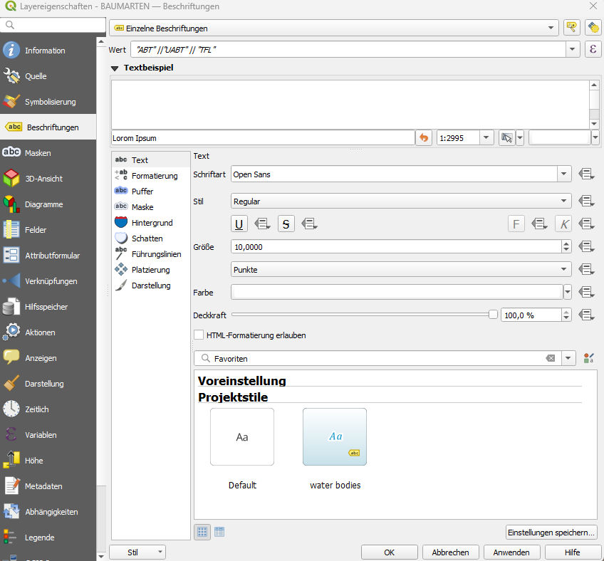
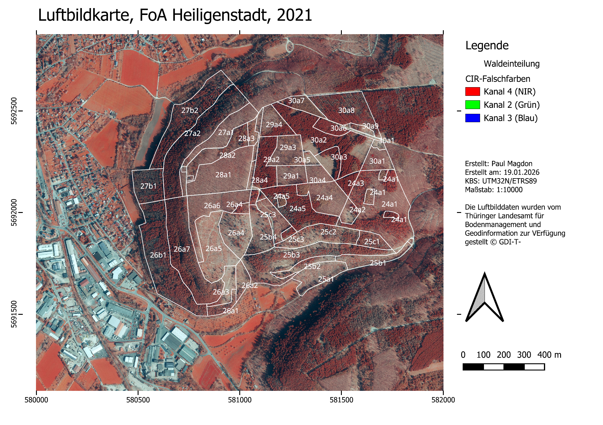
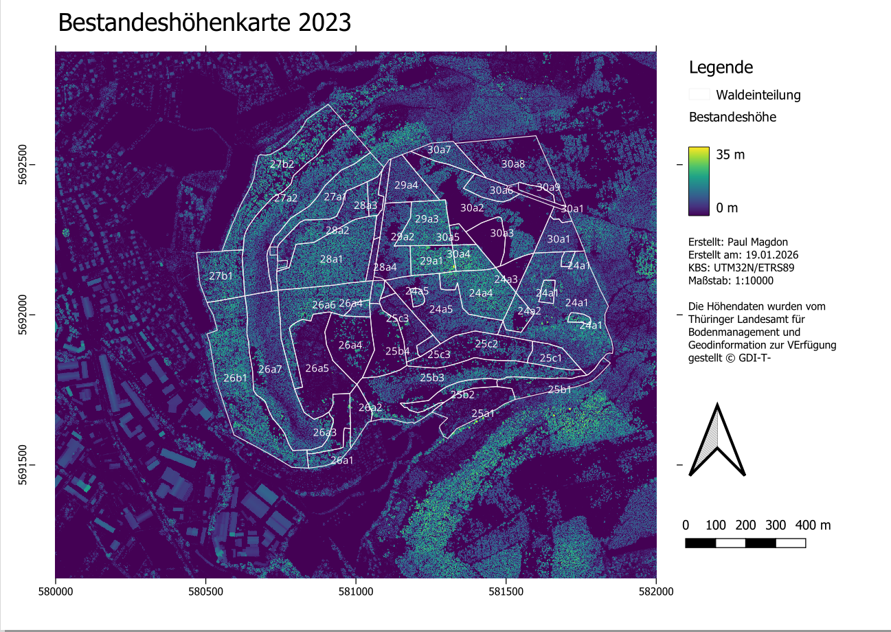
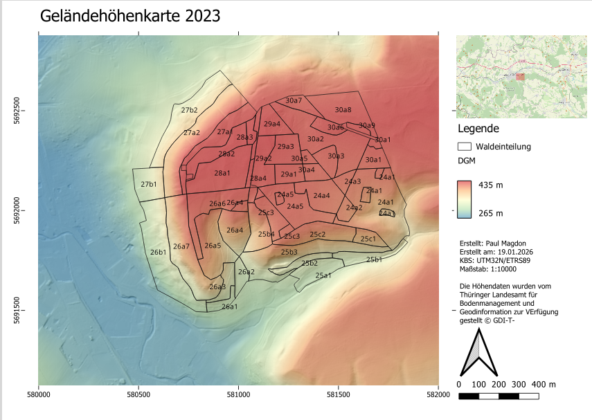

```{=html}
<!--

Skripte für die Übungen 14 des Moduls FPM08 Forstliche Fernerkundung im Studiengang
B.Sc. Forstwirtschaft an der HAWK Göttingen.

Autor: Paul Magdon
Datum: 2026-01-19
Lizenz: Creative Commons BY-NC-SA 4.0 https://creativecommons.org/licenses/by-nc-sa/4.0/

-->
```

# Lerneinheit 14: Erstellen von Kartenlayouts

In dieser Übung wird vorgestellt wie ansprechendes Kartenlayouts erstellen und als exportiert werden
können. Das Kartenlayout soll alle wesentliche Kartenelemente enthalten. QGIS bietet hierzu sehr
viele Optionen, die wir im Rahmen des Kurses nur anschneiden können. Eine detaillierte Beschreibung
der unterschiedlichen Funktionen finden sie in der QGIS-Dokumentation:

<https://docs.qgis.org/3.40/de/docs/user_manual/print_composer/index.html>

## Lernziele & Aufgabenstellung

**Lernziele**

Die Studierenden sollen:

-   Mithilfe der Layoutverwaltung Karten erstellen und verwalten können

-   Alle wichtigen Kartenelemente kennen und erstellen können

-   Unterschiedliche Daten Visualisierungstechniken einsetzen können

**Aufgaben**

1.  Erstellen eines QGIS-Projektes inkl. Datendownload

2.  Erstellen eine Luftbildkarte

3.  Erstellen einer Bestandesshöhenkarte

4.  Erstellen einer Geländehöhenkarte

## Aufgabe 0: Anlegen eine neuen QGIS-Projektes und Kontrolle des Nutzerprofils

Folgen sie der Anleitung aus LE01 @sec-projekt_management um eine neue Ordnerstruktur und ein neues
QGIS-Projekt anzulegen. In der Übung bietet es sich an den Ordner *"daten"* weiter in die
Unterordner *"vektor"* und *"raster"* zu unterteilen. Zusätzlich ist es für diese Übung sinnvoll
einen Ordner "modelle" anzulegen. Prüfen sie außerdem ob Ihr Nutzerprofil korrekt geladen wurde und
ob die OTB-Funktionen im Werkzeugkasten vorhanden sind. Sollte dies nicht der Fall sein stellen sie
ihr gesichertes Nutzerprofil wieder her (siehe auch LE01 @sec-nutzerprofil).

## Aufgabe 01: Download und Import der Geodaten

### Luftbilddaten

Für die Übung verwenden wir Luftbilddaten des Thüringer Landesamts für Bodenmanagement und
Geoinformation (TLBG) im FoA Heilligenstadt. Sie können ein entsprechend vorbereitetes
Ortholuftbildmosaik unter folgendem Link herunterladen:

DOP: <https://cloud.hawk.de/index.php/s/PJoEXMtfRsWgTeQ>

Speichern sie die Daten unter "raster".

### **ALS-basierte Höhendaten**

Für die Übung verwenden wir außerdem Höhendaten des Thüringer Landesamts für Bodenmanagement und
Geoinformation (TLBG). Diese Höhendaten wurden mit Hilfe eines Airborne Laser Scanners (ALS)
erfasst. Für die Übung wurde das DOM bereits auf Basis des DGM zu einem nDOM normalisiert (siehe
@sec-LE12_ndom).

1.) DGM: <https://cloud.hawk.de/index.php/s/ZKnnD8WkYNcEfrk>

2\. )nDOM: <https://cloud.hawk.de/index.php/s/EQQKHgrpwYZWApf>

Speichern sie die Daten unter "raster".

### Vektordaten

Der Landesbetrieb ThüringenForst stellt umfangreiche forstliche Geodaten kostenfrei zur Verfügung.
Unter anderem werden Daten zur Waldeinteilung und Bestockung zur Verfügung gestellt, die wir in der
Übung verwenden wollen. Diese Daten können im ESRI-Shapefile Format unter folgendem Link für ganz
Thüringen heruntergeladen werden:

<https://geomis.geoportal-th.de/geonetwork/srv/ger/catalog.search#/metadata/1f690892-d1c3-436a-819e-a26d207e17d7>

Entpacken sie die Dateien dieses shapefiles in den Ordner *“../daten/vektor/”* und fügen sie die
Waldeinteilung in das QGIS-Projekt ein.

Für die Übung beschränken wir uns auf die Auswertung folgende Abteilungen des FoA Heiligenstadt
(55):

Abt. 24, 25, 26, 27, 28,29, und 30.

Filtern sie dazu den Datensatz wie in Übung @sec-le05_filter vorgestellt.

Anschließen wählen sie eine geeignete Symbolisierung für die Außengrenzen der Bestände. Außerdem
sollen die Bestände nach dem Schema "AbtUabtTF" (z.B. 30a1) beschriftet werden. Dazu können sie
unter `Eigenschaften->Symbolisierung->Beschriftung->Einzelne Beschriftungen` wählen. Da es bisher
kein Feld in der Attributabelle des Datensatzes gibt das die Beschriftung enthält müssen wir einen
Feldausdruck verwenden. Dazu unter "Wert" auf das Summenzeichen gehen und folgenden Ausdruck
hinterlegen:

"ABT" \|\|"UABT" \|\| "TFL"



## Aufgabe 02: Vorbereitung der Rasterkarten

Passen sie nun die Darstellung der drei Rastermosaike wie folgt an:

1.) Das DGM soll als Schummerungsbild dargestellt werden. Für eine attraktivere Darstellung können
sie das Schummerungsbild auch mit einem Pseudofarbkanal überlagern. Erstellen sie dazu zunächst eine
Kopie des DGM-Layers. Nutzen sie für diese Kopie eine Einkanalpseudofarbendarstellung mit einer
geeigneten Farbskala (z.B. spektral invertiert). Stellen sie hier unter Transparanz die
Globaledeckkraft auf 50%. Dadurch wird dieses Layer halbtransparent dargestellt und das
darunterliegende Schummerungsbild zusätzlich sichtbar.

2.) Dasn nDOM soll als Einkanalpseudofarbe mit der Farbpalette "viridis" dargestellt werden. Stellen
sie sicher das der Wertebereich der Legende bei 0 startet und möglichst in geraden Schritten (z.B.
5m ) einteilt.

3.) Das DOP soll als CIR-Falschfarbenbild dargestellt sein.

## Aufgabe 03: Erstellen eines Kartenlayouts für eine Luftbildkarte

In einem QGIS Projekt können mehrere Karten erstellt und gespeichert werden. Zur Verwaltung der
verschiedenen Karten wird der Kartenlayout-Manager verwendet. Sie finden diesen im Menü unter Projekt.
Hier können sie ein neues Drucklayout „Luftbild“ anlegen.

Nachdem sie ein Kartenlayout im Manager angelegt haben öffnet sich ein neues Fenster mit dem noch
leeren Kartenlayout. Um ein erstes Layout zu erstellen gehen wir folgende Schritte durch:

1.)  Hinzufügen eines Kartenfelds.

Dazu wählen sie links das Werkzeug "Karte hinzufügen" und ziehen anschließend in ihrem Layout ein
Kartenfeld auf. QGIS stellt danach automatisch die Layer aus dem Hauptfenster dar.

2.) Hinzufügen eines Titels

Dazu wählen sie links das Werkzeug "Beschriftung hinzufügen" und ziehen anschließend ein Textfeld
oberhalb ihrer Karte auf. Geben sie dann im Feld rechts unter „Beschriftung“ einen sinnvollen Titel
(z.b. Luftbildkarte FoA Heiligenstadt) ein und wählen sie eine passende Schriftgröße aus.

3.) Hinzufügen einer Legende

Dazu wählen sie links das Werkzeug "Legende hinzufügen" aus und ziehen anschließend ein Legendenfeld
rechts neben ihren Kartenfeld auf. QGIS übernimmt für die Legende dann automatisch die
Symbolisierung aller Layer des Projektes. Wenn sie rechts unter Legendenelemente die Funktion
„Automatisch aktualisieren“ entfernen, können sie Einträge manuell hinzufügen und entfernen.

4.) Hinzufügen eine Nordpfeils

Dazu wählen sie links das Werkzeug "Nordpfeil hinzufügen" und ziehen anschließend ein Fenster für
den Nordpfeil auf.

5.) Koordinatengitter hinzufügen

Um ein Koordinatengitter hinzuzufügen selektieren sie zunächst das Kartenfenster in dem sie darauf
klicken. Anschließend öffnen sie die Option „Gitter“, die ihnen im rechten Teil unter den
Haupteigenschaften des Kartenfelds angezeigt wird. Über das grüne Plus Symbol legen sie ein neues
Gitter an. Anschließend wählen sie dieses Gitter aus, und klicken auf „Gitter ändern“. Hier ändern
wir folgende Optionen:

-   Gittertype: „Nur Rahmen und Beschriftungen“

-   Intervall: X=500m, Y=500m

-   Rahmenstil: „Äußere Markierung“

-   Koordinaten zeichnen: „ja“

-   Koordinaten nur "links" und "unten". "Oben und "rechts" deaktivieren

-   Koordinatengenauigkeit: 0

6.) Maßstab

Fügen sie ein graphischen Maßstabsbalken hinzu. Dazu wählen sie links das Werkzeug "Maßstab
hinzufügen" und ziehen anschließend ein Fenster für den Maßstab auf. Über die Eigenschaften dieses
Elements können sie z.B. die Anzahl an Segmenten steuern.

7.) Kartenfeld

Sie sollten der Karte noch einige weitere Metadaten hinzufügen. Dazu legen sie, wie beim Titel, ein
neues Textfeld an und ergänzen hier ihren Namen und das Koordinatenreferenzsystem.



## Aufgabe 04: Erstellen eines Kartenlayouts für eine Bestandeshöhenkarte

Im nächsten Schritt soll eine Bestandeshöhenkarte erstellt werden. Damit nicht alle Layout-Elemente
neu erstellt werden müssen, bietet es sich an das bestehende Layout als Vorlage zu verwenden. Dazu
kann unter `Projekte -> Layout-Verwaltung` das bestehende Layout dupliziert und eines neues Layout
mit dem Namen "Bestandeshöhenkarte" angelegt werden.

Im neuen Layout müssen nun Titel, Legende und Kartenfeld entsprechend angepasst werden.



## Aufgabe 05: Erstellen eines Kartenlayouts für eine Geländemodellkarte

Als dritte Karte soll eine Karte mit dem Geländemodell erstellt werden. Dazu soll eine
Schummerungskarte mit einer Pseudofarbkarte überblendet werden. Außerdem soll eine zweites
Kartenfeld mit einer Übersichtkarte hinzugefügt werden. Die Übersichtskarte soll den Maßstab
1:500000 haben und Openstreetmap Daten darstellen. Außerdem soll ein Indikator den Ausschnitt der
Hautkarte anzeigen.


